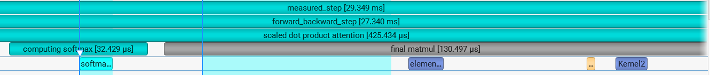
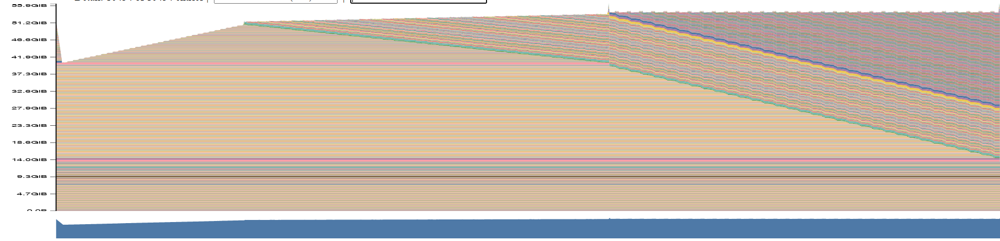
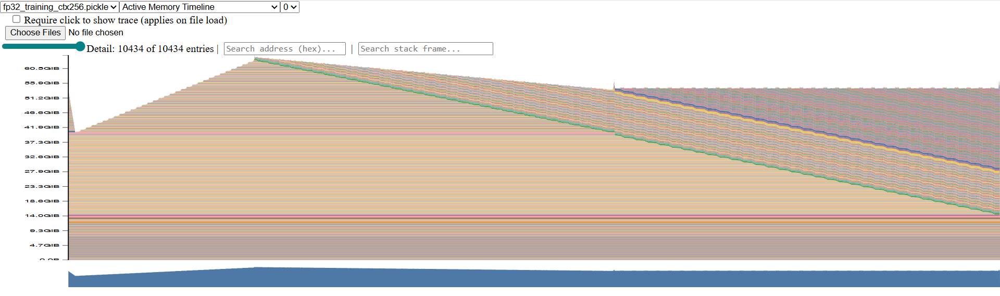
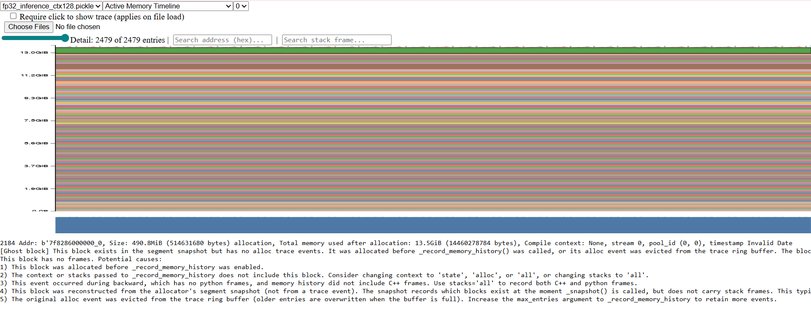
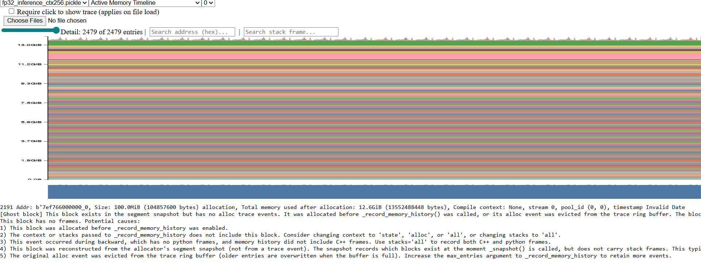
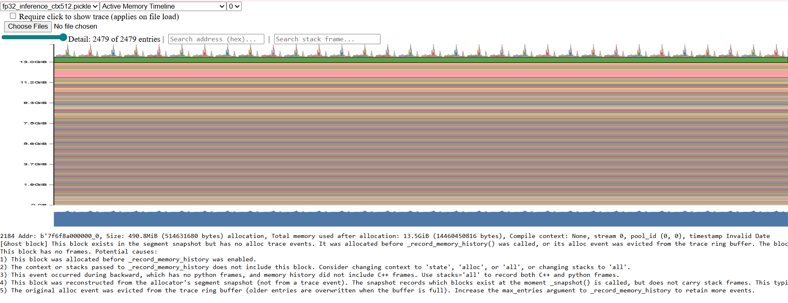
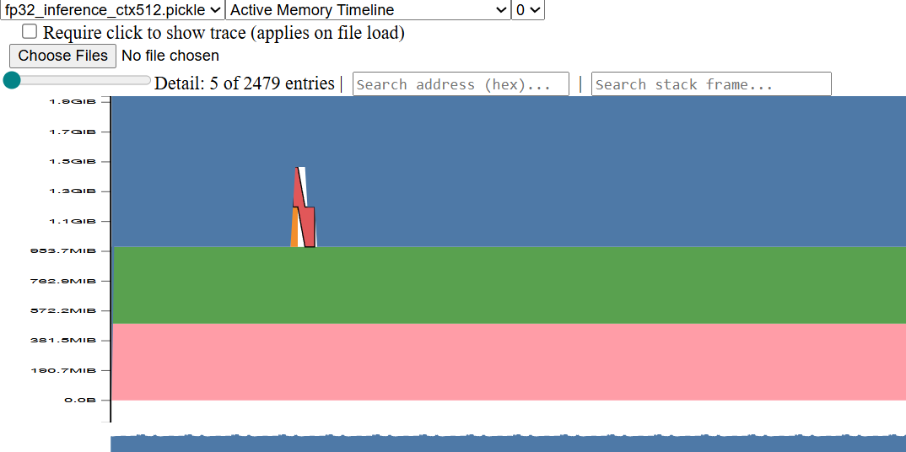

# Systems and Parallelism
## Profiling and benchmarking
### benchmark_script
- a. 
```bash
./run_benchmark_sweep_and_dump.sh
```
(b) With 5 warmup steps and 10 measured steps, for the smallest model (`d_model=256`, `L=4`, `H=8`, `d_ff=1024`, `batch_size=8`, `context_length=128`), the forward pass takes `5.98 ± 0.12 ms` and the forward+backward pass takes `33.15 ± 3.98 ms`, so the backward pass is approximately `27.17 ms` by subtraction. The forward timing is very stable, while the backward timing shows somewhat higher variability, though its standard deviation is still modest compared with the zero-warmup case.

(c) Without warmup, the timings become much noisier and the mean is heavily inflated by slow first iterations; for example, at `context_length=128`, the forward pass changes from `5.98 ± 0.12 ms` with 5 warmup steps to `52.42 ± 146.35 ms` with 0 warmup steps. This happens because early iterations include one-time overheads such as CUDA/runtime initialization, memory allocator setup, and cache effects; with only 1 or 2 warmup steps, results can still differ slightly because these transient costs may not yet be fully amortized, especially for backward and training-step measurements.
### nsys_profile

(a) For the small CUDA configuration (`d_model=256`, `L=4`, `H=8`, `d_ff=1024`, `batch_size=8`), the forward pass takes about `5.98 ms` at `context_length=128`, increasing to about `16.85 ms` at `context_length=1024`. This matches the Python benchmark reasonably well: the CUDA benchmark reports `5.98 ms` at `context_length=128`, while Nsight shows a steady-state `forward_step` of about `6–7 ms`; the earlier mismatch came from accidentally comparing against CPU results.

#### Forward pass kernel summary(`nsys_forward_ctx128_d256_L4`)

| Time % | Total Time | Instances | Avg | Med | Min | Max | StdDev | Name |
|---|---:|---:|---:|---:|---:|---:|---:|---|
| 39.1% | 7.157 ms | 15 | 477.153 μs | 477.093 μs | 473.349 μs | 480.326 μs | 2.165 μs | `void cutlass::Kernel2<cutlass_80_simt_sgemm_128x256_8x4_tn_align1>(T1::Params)` |
| 22.1% | 4.049 ms | 180 | 22.494 μs | 25.824 μs | 15.424 μs | 26.592 μs | 4.895 μs | `void cutlass::Kernel2<cutlass_80_simt_sgemm_128x128_8x4_tn_align1>(T1::Params)` |
| 8.0% | 1.463 ms | 240 | 6.095 μs | 6.080 μs | 5.920 μs | 6.624 μs | 114 ns | `void cutlass::Kernel2<cutlass_80_simt_sgemm_128x64_8x5_tn_align1>(T1::Params)` |
| 7.3% | 1.337 ms | 750 | 1.782 μs | 1.824 μs | 1.440 μs | 2.048 μs | 162 ns | `void at::native::elementwise_kernel<...MulFunctor<float>...>(int, T3)` |
| 3.6% | 659.236 μs | 300 | 2.197 μs | 2.112 μs | 2.016 μs | 2.624 μs | 164 ns | `void cublasLt::splitKreduce_kernel<...>(...)` |
| 2.7% | 497.637 μs | 360 | 1.382 μs | 1.312 μs | 1.280 μs | 1.537 μs | 94 ns | `void at::native::elementwise_kernel<...direct_copy_kernel_cuda...>(int, T3)` |
| 2.1% | 380.774 μs | 360 | 1.057 μs | 960 ns | 928 ns | 1.312 μs | 138 ns | `void at::native::vectorized_elementwise_kernel<...CUDAFunctor_add<float>...>(int, T2, T3)` |
| 2.0% | 363.206 μs | 60 | 6.053 μs | 6.048 μs | 5.856 μs | 6.305 μs | 85 ns | `void magma_sgemmEx_kernel<float, float, float, ...>(...)` |
| 1.8% | 323.880 μs | 60 | 5.398 μs | 5.408 μs | 5.344 μs | 5.440 μs | 18 ns | `void cutlass::Kernel2<cutlass_80_simt_sgemm_64x64_8x5_nn_align1>(T1::Params)` |
| 1.7% | 304.803 μs | 120 | 2.540 μs | 2.528 μs | 2.496 μs | 2.752 μs | 35 ns | `void at::native::vectorized_elementwise_kernel<...MulFunctor<float>...>(int, T2, T3)` |

#### Forward + backward kernel summary (`nsys_forward_backward_ctx512_d256_L4`)

| Time % | Total Time | Instances | Avg | Med | Min | Max | StdDev | Name |
|---|---:|---:|---:|---:|---:|---:|---:|---|
| 13.4% | 31.472 ms | 135 | 233.124 μs | 45.472 μs | 44.865 μs | 1.739 ms | 532.455 μs | `void cutlass::Kernel2<cutlass_80_simt_sgemm_128x256_8x4_tn_align1>(T1::Params)` |
| 13.1% | 30.750 ms | 15 | 2.050 ms | 2.049 ms | 2.044 ms | 2.065 ms | 5.640 μs | `void at::native::<unnamed>::cunn_SoftMaxBackward<...>(...)` |
| 9.7% | 22.689 ms | 15 | 1.513 ms | 1.512 ms | 1.507 ms | 1.523 ms | 4.298 μs | `void cutlass::Kernel2<cutlass_80_simt_sgemm_128x128_8x4_nt_align1>(T1::Params)` |
| 9.2% | 21.596 ms | 15 | 1.440 ms | 1.439 ms | 1.429 ms | 1.449 ms | 4.438 μs | `void cutlass::Kernel2<cutlass_80_simt_sgemm_256x128_8x4_nn_align1>(T1::Params)` |
| 7.3% | 17.103 ms | 15 | 1.140 ms | 1.141 ms | 1.137 ms | 1.143 ms | 1.821 μs | `void at::native::<unnamed>::cunn_SoftMaxForward<...>(...)` |
| 6.5% | 15.186 ms | 480 | 31.638 μs | 27.856 μs | 10.465 μs | 57.569 μs | 21.082 μs | `void cutlass::Kernel2<cutlass_80_simt_sgemm_64x64_8x5_nt_align1>(T1::Params)` |
| 4.6% | 10.834 ms | 960 | 11.285 μs | 4.224 μs | 832 ns | 90.561 μs | 20.221 μs | `void at::native::vectorized_elementwise_kernel<...MulFunctor<float>...>(int, T2, T3)` |
| 4.1% | 9.500 ms | 300 | 31.667 μs | 25.793 μs | 25.153 μs | 57.377 μs | 11.860 μs | `void cutlass::Kernel2<cutlass_80_simt_sgemm_128x128_8x4_tn_align1>(T1::Params)` |
| 3.6% | 8.389 ms | 360 | 23.303 μs | 13.184 μs | 12.769 μs | 48.833 μs | 14.545 μs | `void cutlass::Kernel2<cutlass_80_simt_sgemm_128x64_8x5_nn_align1>(T1::Params)` |
| 3.2% | 7.467 ms | 165 | 45.254 μs | 928 ns | 704 ns | 475.878 μs | 136.104 μs | `void at::native::vectorized_elementwise_kernel<...FillFunctor<float>...>(int, T2, T3)` |

| Time | Total Time | Instances | Avg | Med | Min | Max | StdDev | Style | Range |
|---|---:|---:|---:|---:|---:|---:|---:|---|---|
| 46.3% | 1.172 s | 15 | 78.144 ms | 32.279 ms | 17.144 ms | 749.070 ms | 185.740 ms | PushPop | `:forward_backward_step` |
| 33.6% | 850.842 ms | 1 | 850.842 ms | 850.842 ms | 850.842 ms | 850.842 ms | 0 ns | PushPop | `:warmup` |
| 13.7% | 347.582 ms | 10 | 34.758 ms | 35.021 ms | 29.349 ms | 40.028 ms | 3.527 ms | PushPop | `:measured_step` |
| 3.6% | 92.154 ms | 60 | 1.536 ms | 442.359 μs | 238.299 μs | 66.464 ms | 8.525 ms | PushPop | `:scaled dot product attention` |
| 1.0% | 25.905 ms | 60 | 431.758 μs | 171.224 μs | 90.340 μs | 15.419 ms | 1.969 ms | PushPop | `:computing attention scores` |
| 0.9% | 22.781 ms | 60 | 379.685 μs | 32.531 μs | 18.586 μs | 20.879 ms | 2.691 ms | PushPop | `:computing softmax` |
| 0.5% | 12.220 ms | 15 | 814.683 μs | 70.968 μs | 42.483 μs | 11.281 ms | 2.896 ms | PushPop | `CCCL:cub::DeviceRadixSort` |
| 0.3% | 8.745 ms | 60 | 145.751 μs | 132.597 μs | 71.048 μs | 1.175 ms | 137.457 μs | PushPop | `:final matmul` |

(b) During the forward pass, the kernel with the largest cumulative GPU time is `void cutlass::Kernel2<cutlass_80_simt_sgemm_128x256_8x4_tn_align1>(T1::Params)`, which takes `7.157 ms` total and is invoked `15` times in one forward pass. Yes—the same CUTLASS GEMM kernel also has the largest cumulative GPU time in the forward+backward profile (`31.472 ms` over `135` invocations).

(c) Besides matrix multiplies, the forward pass spends non-trivial CUDA time in `elementwise_kernel`, `vectorized_elementwise_kernel`, `softmax_warp_forward`, `splitKreduce_kernel`, and smaller indexing/reduction kernels. Their contribution grows with context length: for example, at `context_length=1024`, `elementwise_kernel`, `vectorized_elementwise_kernel`, and `softmax_warp_forward` account for `16.8%`, `14.3%`, and `11.9%` of kernel time, respectively.

(d) In a full training step, matrix multiplications still account for the largest single share of CUDA runtime, but their fraction drops substantially compared with forward-only inference and decreases further as context length grows. For example, the `Kernel2` GEMM group is about `72.7%` in forward-only inference at `context_length=256`, but only about `55.3%` in forward+backward at `256`, `51.3%` at `512`, and `41.7%` at `1024`, while non-GEMM kernels such as `cunn_SoftMaxBackward`, `vectorized_elementwise_kernel`, and `elementwise_kernel` take a much larger share during training.



(e) Within the self-attention forward pass, the softmax kernel takes about `2.649 ms`, while the two matrix-multiplication parts take about `3.301 ms` (`computing attention scores`) and `3.299 ms` (`final matmul`). Thus, the runtime gap is much smaller than the FLOP gap: matmuls dominate FLOPs by a wide margin, but softmax still takes comparable wall-clock time because it is more memory/reduction-bound and has lower arithmetic intensity.
### mixed_precision_accumulation
```
fp32_accum_fp32_input=10.000133514404297
fp16_accum_fp16_input=9.953125
fp32_accum_fp16_input=10.00213623046875
fp32_accum_cast_fp16_input=10.00213623046875
```
The results show that accumulation precision matters more than input precision: FP32 accumulation with FP32 inputs is very accurate (10.0001335), while FP16 accumulation with FP16 inputs has much larger error (9.953125). When accumulation is kept in FP32 but inputs are FP16, the result is still close to 10 (10.0021362), and explicitly casting FP16 inputs to FP32 gives the same value, indicating the remaining error comes from FP16 quantization of 0.01 rather than FP32 accumulation itself. This illustrates why mixed precision typically keeps accumulation/reduction in higher precision.
### benchmarking_mixed_precision
#### a.
- Model parameters: torch.float32

- fc1 output: torch.float16

- LayerNorm output: torch.float32

- Logits: torch.float16

- Loss: torch.float32

- Gradients: torch.float32
#### b.
LayerNorm is sensitive because it relies on reductions (mean/variance), normalization, and division, which are numerically fragile in low precision, especially FP16.
So autocast typically keeps LayerNorm-related computation in FP32 even when surrounding linear layers run in FP16.
With BF16, stability is better than FP16 due to larger dynamic range, but LayerNorm/reduction paths are still commonly kept in FP32 for robustness.
#### c.
- size0 (256,4,8,1024): FP32 58.7740 ms vs BF16 autocast 48.1620 ms (speedup 1.2203x)

- size1 (512,8,8,2048): FP32 136.2530 ms vs BF16 autocast 100.4140 ms (speedup 1.3569x)

- size2 (768,12,12,3072): FP32 312.8410 ms vs BF16 autocast 215.1880 ms (speedup 1.4538x)

The speedup increases with model size, which is consistent with larger models spending a greater fraction of time in tensor-core-friendly matmul workloads where BF16 autocast helps more.

### memory_profiling
### Training step timelines

| Full training step | Training step (ctx=256) |
|---|---|
|  |  |

### Inference-only timelines

| ctx=128 | ctx=256 | ctx=512 |
|---|---|---|
|  |  |  |
- The inference memory timeline is nearly flat (~12–13 GiB) with small transient spikes, indicating no activation accumulation and immediate buffer reuse. In contrast, the full training step shows a clear three-phase pattern: memory increases during the forward pass due to activation storage, decreases steadily during the backward pass as activations are freed in reverse order, and exhibits minor fluctuations during the optimizer step. Thus, the stages can be reliably identified from the memory peaks and slopes.
- 
| Context length | Forward peak reserved (GB) | Full training step peak reserved (GB) |
|---|---:|---:|
| 128 | 14.370 | 63.176 |
| 256 | 14.974 | 74.340 |
| 512 | 16.066 | N/A (missing from provided logs) |

- With mixed-precision (bf16 autocast), the peak memory usage is about 21 GiB for the forward pass and 58–64 GiB for a full training step. Mixed-precision does not significantly reduce memory usage in this setup; forward memory actually increases slightly, and training memory remains nearly unchanged because model parameters and optimizer states are still stored in fp32.
- The residual stream activation tensor has shape (batch size, context length, d_model). Using $$B = 8, T = 256$$, and $$d_{model} = 2560$$, the size in fp32 is:

$$
\frac{(8 \times 256 \times 2560 \times 4)}{ 1024^2} \approx 20 MB
$$
Thus, a single residual stream activation tensor is approximately 20 MB in single precision.



- The largest allocations are approximately 490 MiB. From the stack trace and their size, these correspond to attention-related tensors (e.g., $QK^T$ and softmax buffers) created during the forward pass, which scale as $O(B \times H \times T^2)$ and dominate memory usage.